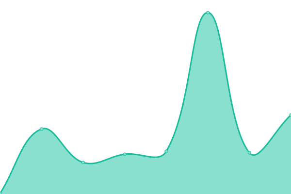

# [📈 Live Status](https://Derillo.github.io/uptime): <!--live status--> **🟩 All systems operational**

This repository contains the open-source uptime monitor and status page for [Derillo](https://Derillo.github.io/uptime), powered by [Upptime](https://github.com/upptime/upptime).

With [Upptime](https://upptime.js.org), you can get your own unlimited and free uptime monitor and status page, powered entirely by a GitHub repository. We use [Issues](https://github.com/Derillo/uptime/issues) as incident reports, [Actions](https://github.com/Derillo/uptime/actions) as uptime monitors, and [Pages](https://Derillo.github.io/uptime) for the status page.

<!--start: status pages-->
<!-- This summary is generated by Upptime (https://github.com/upptime/upptime) -->
<!-- Do not edit this manually, your changes will be overwritten -->
<!-- prettier-ignore -->
| URL | Status | History | Response Time | Uptime |
| --- | ------ | ------- | ------------- | ------ |
|  [Google](https://www.google.com) | 🟩 Up | [google.yml](https://github.com/Derillo/uptime/commits/HEAD/history/google.yml) | 

 130ms
     
 | 

<a href="https://Derillo.github.io/uptime/history/google">100.00%</a>
    

|  [Donweb](https://donweb.com) | 🟩 Up | [donweb.yml](https://github.com/Derillo/uptime/commits/HEAD/history/donweb.yml) | 

 1389ms
     
 | 

<a href="https://Derillo.github.io/uptime/history/donweb">100.00%</a>
    

|  [myc](https://mocoroacostantinis.com.ar) | 🟩 Up | [myc.yml](https://github.com/Derillo/uptime/commits/HEAD/history/myc.yml) | 

 1423ms
     
 | 

<a href="https://Derillo.github.io/uptime/history/myc">100.00%</a>
    

|  [Test Broken Site](https://luzpreumayr.com/) | 🟩 Up | [test-broken-site.yml](https://github.com/Derillo/uptime/commits/HEAD/history/test-broken-site.yml) | 

 2186ms
     
 | 

<a href="https://Derillo.github.io/uptime/history/test-broken-site">100.00%</a>
    

<!--end: status pages-->

[**Visit our status website →**](https://Derillo.github.io/uptime)

## 📄 License

- Powered by: [Upptime](https://github.com/upptime/upptime)
- Code: [MIT](./LICENSE) © [Derillo](https://Derillo.github.io/uptime)
- Data in the `./history` directory: [Open Database License](https://opendatacommons.org/licenses/odbl/1-0/)
